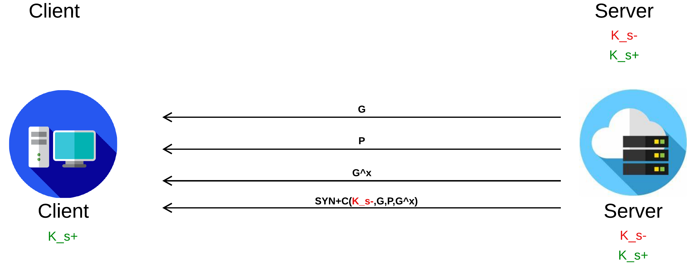
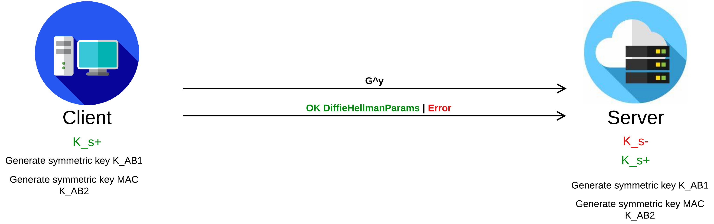
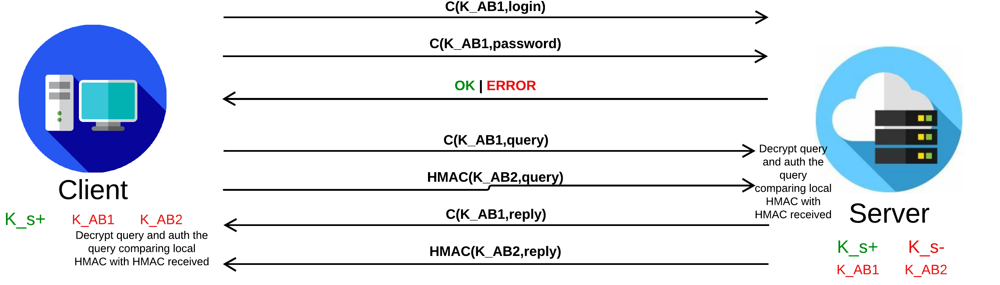
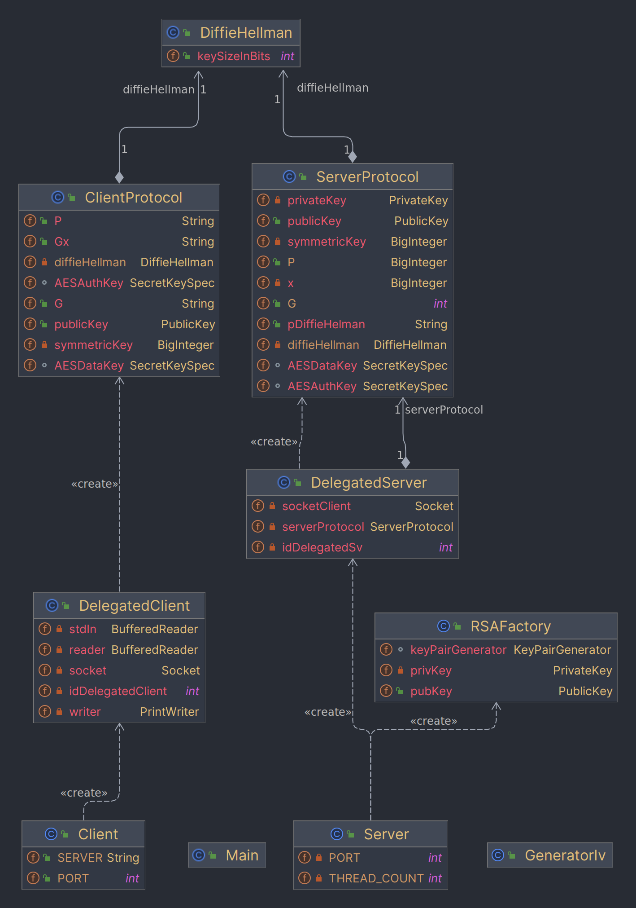
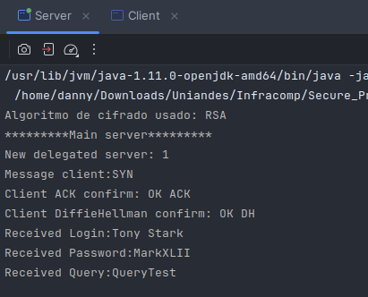
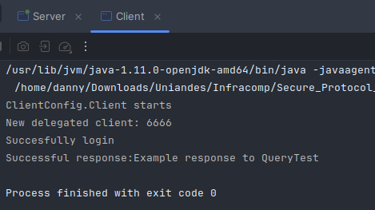

# Secure Protocol Connection Lab (SPCL)

This repository contains the implementation of a client 
and server for an online query service that ensures 
confidentiality and integrity using encryption and 
digital signature algorithms. The goal is to understand
and apply concepts of computer security in communication
between client and server. The protocol model to use, is the **HTTPS
protocol connection** between client and server, imitating the use of the 
**TCP/IP connection protocol with three-way handshake.**

## Table of contents

1. [Connection model](#Connection_model)
2.  [Code structure](#Code_structure)
3. [How to run?](#How_to_run)
4. [Documentacion](#Documentacion)

## Connection_model
### 1. Three-way handshake

The protocol begins with a standard Three-way handshake 
between both parties. What changes in the server response
is that the server signs its connection so that it 
can authenticate itself and the client can verify that
it is indeed the server. Therefore, when the server 
confirmation arrives, the client must verify with the public 
key sent in that same message that the server is indeed who it claims to be.

### 2. Share DiffieHellman params

After the server has authenticated and
accepted the connection with the client, 
the server proceeds to send the parameters 
of the Diffie-Hellman algorithm, which are:
1. **G**: A random prime number smaller than P.
2. **P**: A random large prime number of 1024 bits that ensures the connection for asymmetric keys.
3. **G^x**: G^x mod P, the number agreed upon to send to the client.
4. **C(K_s-, G, P, G^x)**: Encryption with the server's private key of the aforementioned Diffie-Hellman parameters.

### 3. Generate symmetric keys

Key Agreement for Symmetric Keys
After mutual authentication, both the server and the client agree on two symmetric keys:

#### Key Agreement for Symmetric Keys

After mutual authentication, both the server and the client agree on two symmetric keys:

1. **Key K_AB1**: A 256-bit symmetric key responsible for encrypting messages between the client and the server. It is generated using AES in CBC mode with 256Padding.

2. **Key MAC_AB2**: A 256-bit symmetric key used to encrypt authentication messages using the HMAC SHA256 algorithm.

These keys are essential for ensuring secure communication between the client and the server, providing confidentiality and authentication.

### 4. Future communications

## Code_structure

### 1. Clase [ClientPrtocol.java](src/ClientConfig/ClientProtocol.java)
La clase `ClientProtocol` se encarga de gestionar la comunicación segura entre el cliente y el servidor utilizando varios protocolos y algoritmos criptográficos. A continuación, se presenta una breve descripción de las principales funcionalidades de la clase:

- **Inicialización y Atributos**: La clase contiene atributos para almacenar la clave pública del servidor, así como los parámetros del algoritmo Diffie-Hellman (P, G, Gx) y las claves simétricas generadas durante el proceso de comunicación.

- **Método `processResponse`**: Este método maneja la interacción entre el cliente y el servidor a través de una serie de pasos definidos. Utiliza objetos de entrada y salida para enviar y recibir mensajes cifrados, autenticar la conexión, generar claves simétricas y enviar consultas de manera segura.

- **Métodos de Verificación**: La clase incluye métodos para verificar la autenticidad de los mensajes recibidos, como la verificación de la firma RSA del servidor y la validación de las claves Diffie-Hellman generadas por el servidor.

- **Generación de Claves Simétricas y Cifrado**: Se implementan métodos para generar claves simétricas, dividirlas en subclaves y utilizarlas para cifrar y descifrar mensajes utilizando el algoritmo AES en modo CBC, así como para calcular códigos de autenticación HMAC.

En resumen, la clase `ClientProtocol` proporciona una estructura para establecer una comunicación segura y autenticada entre el cliente y el servidor, utilizando técnicas criptográficas como Diffie-Hellman, RSA, AES y HMAC para garantizar la confidencialidad, integridad y autenticidad de los datos transmitidos.

### 2. Clase [ClientPrtocol.java](src/ServerConfig/ServerProtocol.java)
La clase `ServerProtocol` se encarga de gestionar la comunicación segura desde el lado del servidor utilizando varios algoritmos criptográficos y protocolos definidos. A continuación, se presenta una breve descripción de las principales funcionalidades de la clase:

- **Inicialización y Atributos**: La clase contiene atributos para almacenar la clave privada del servidor, la clave pública del cliente, así como los parámetros del algoritmo Diffie-Hellman (P, G, Gx) y las claves simétricas generadas durante el proceso de comunicación.

- **Método `processMessage`**: Este método maneja la recepción de mensajes del cliente y envía respuestas cifradas y autenticadas. Utiliza objetos de entrada y salida para leer y escribir mensajes, así como para realizar el cifrado y descifrado de datos utilizando algoritmos como RSA, AES y HMAC.

- **Generación de Parámetros y Claves**: Implementa métodos para generar parámetros del algoritmo Diffie-Hellman, generar y dividir claves simétricas, así como para cifrar y autenticar mensajes utilizando las claves generadas.

En resumen, la clase `ServerProtocol` proporciona una estructura para gestionar la comunicación segura desde el lado del servidor, utilizando técnicas criptográficas como Diffie-Hellman, RSA, AES y HMAC para garantizar la confidencialidad, integridad y autenticidad de los datos transmitidos entre el servidor y el cliente.

###  Clase [DiffieHellman.java](src/SecureAlgorithms/DiffieHellman.java)

La clase `DiffieHellman` implementa el algoritmo de intercambio de claves Diffie-Hellman, junto con funciones criptográficas adicionales para el cifrado y la generación de claves. A continuación, se describe brevemente cada una de las funcionalidades proporcionadas por esta clase:

- **Generación de Clave Privada Aleatoria**: El método `generateRandomPrivateKey` genera una clave privada aleatoria utilizando un generador de números aleatorios seguro (`SecureRandom`) y la convierte en un objeto `BigInteger`.

- **Generación de Clave Pública (G^X % P)**: El método `getGpowerXY` calcula la clave pública a partir de la clave privada, el parámetro P y el generador G utilizando la operación modular.

- **Cálculo de Clave Simétrica Compartida**: El método `getSymmetricKey` calcula la clave simétrica compartida a partir de la clave pública del otro partido, la clave privada local y el parámetro P.

- **División de Clave DH para Cifrado y HMAC**: El método `divideDHKey` toma la clave simétrica generada por Diffie-Hellman y la divide en dos partes, una para cifrado y otra para el código HMAC, utilizando SHA-512 como función hash.

- **Generación de Claves AES Seguras**: El método `makeSecureAESKeys` crea objetos `SecretKeySpec` para ser utilizados como claves AES a partir de los bytes obtenidos en la división de la clave DH.

- **Cifrado y Descifrado AES**: Los métodos `AESEncryptionAB1` y `AESDecryptionAB1` realizan operaciones de cifrado y descifrado utilizando el algoritmo AES en modo ECB con relleno PKCS5.

- **Cálculo de HMAC**: El método `encryptHmac` calcula el código HMAC utilizando el algoritmo HmacSHA256 para autenticar mensajes.

En resumen, la clase `DiffieHellman` proporciona una implementación completa del algoritmo Diffie-Hellman junto con funciones criptográficas para garantizar la confidencialidad, integridad y autenticidad en el intercambio de claves y mensajes en un entorno seguro.

### 3. Clase [RSAFactory.java](src/SecureAlgorithms/RSAFactory.java)
### Clase RSAFactory

La clase `RSAFactory` implementa un generador de claves RSA para la creación de pares de claves pública y privada. Aquí está la descripción breve:

- **Generador de Claves RSA**: La clase utiliza la clase `KeyPairGenerator` para generar un par de claves RSA con una longitud de 4096 bits.

- **Inicialización y Generación de Claves**: El método `getKeys` inicializa el generador de claves con la longitud deseada y genera un par de claves público-privado.

- **Obtención de Clave Privada**: El método `getPrivKey` permite obtener la clave privada generada por el objeto `RSAFactory`.

En resumen, la clase `RSAFactory` proporciona una manera sencilla de generar pares de claves RSA para su uso en cifrado y firma digital.

**Nota:**
Las clases como `Client/DelegatedClient` y `Server/DelegatedServer` solo son clases que se encargan de
manejar la concurrencia para hacer pruebas con muchos clientes y servidores delegados.

## How_to_run
### 1. Ejecutar con muchos clientes concurrentes
Si quiere correr muchas pruebas 
simultaneas con threads, ejecute el [Main](src/Main.java).
Aqui se inicializa automaticamente el servidor y puede elegir 
cuantos clientes concurrentes desea inicializar para hacer consultas.
El input aveces se corre una linea, sin embargo digite correctamente un numero de clientes deseado.
### 2. Ejecutar individualmente
Con esta opcion usted podra verificar conexiones individuales **para un servidor y un cliente concurrente**
1. Ejecutar el [Servidor](src/ServerConfig/Server.java): Ejecute un solo servidor para la prueba
2. Iniciar el [Cliente](src/ClientConfig/Client.java): Ejecute un solo cliente para la prueba

Luego de hacerlo, podra ver la consola de cada ejecucion por aparte de la siguiente manera: **Consola del servidor**

**Consola del cliente**

Nota: Por temas de facilidad de pruebas la consulta, input y login del cliente son
variables estaticas ya generadas. Sin embargo, puede ingresarse por input descomentando el codigo presente en [Cliente](src/ClientConfig/ClientProtocol.java)

## Documentacion
Puede revisar las pruebas realizadas y las preguntas en: [Documento](src/Docs)
